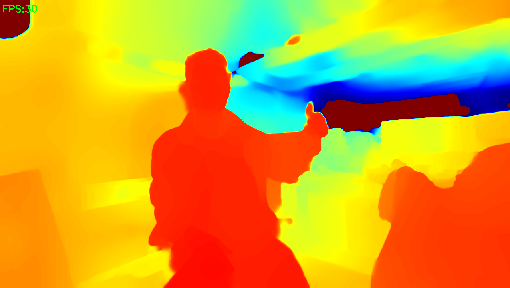
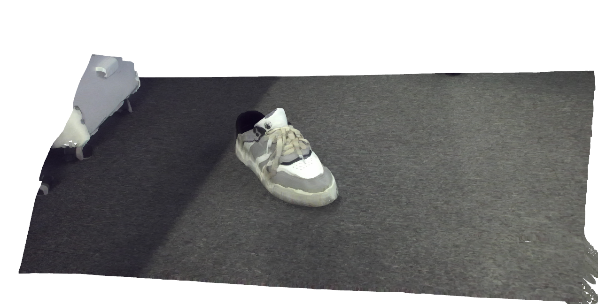
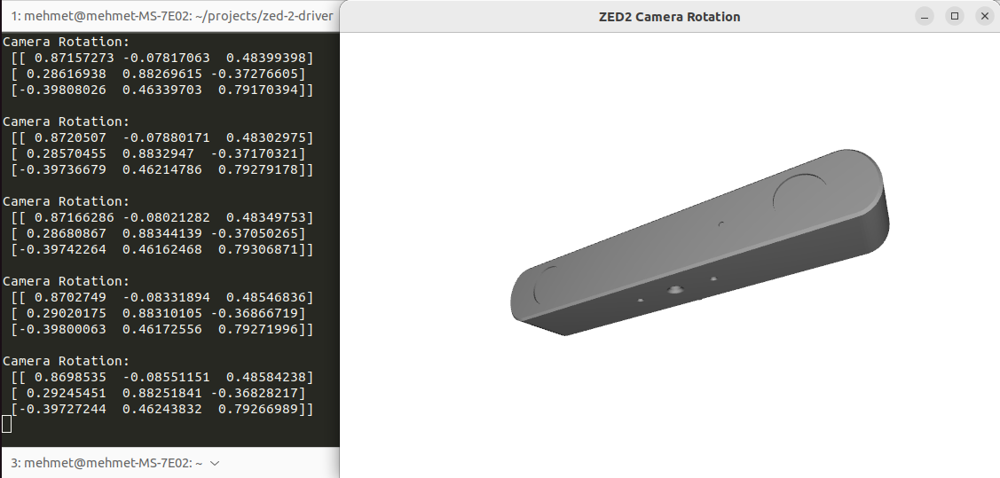

# Zed 2 Driver

Stereolabs Zed 2 Stereo Depth Camera Driver in Python. The camera was tested with Python 3.10.12 on Ubuntu 20.04 and 22.04 LTS distributions.


## Documentations

Following link to access Zed 2 official website:
- https://www.stereolabs.com/en-tr/products/zed-2

Following link to access Github page:
- https://github.com/stereolabs/zed-sdk

Following link to access official documentation:
- https://www.stereolabs.com/docs/get-started-with-zed

Following link to access Linux installation page:
- https://www.stereolabs.com/docs/installation/linux

Following link to access Python API reference:
- https://www.stereolabs.com/docs/api/python

Following link to access Python tutorial and examples:
- https://github.com/stereolabs/zed-sdk/tree/master/tutorials

## Recommended Specifications

It is recommended the following system specifications to use the ZED SDK:


## Installation

First of all, download latest Zed SDK from this link for your system:
- https://www.stereolabs.com/en-tr/developers/release

> If you have Ubuntu 20.04, you can choose CUDA 11 - TensorRT 10 (ZED SDK for Ubuntu 20 5.0)

> If you have Ubuntu 22.04, you can choose CUDA 12 - TensorRT 10 (ZED SDK for Ubuntu 22 5.0)

Install required package first:
```
sudo apt update
sudo apt install zstd
```

Go to downloaded file directory. Assuming Ubuntu 22 and downloaded file name is "ZED_SDK_Ubuntu22_cuda12.8_tensorrt10.9_v5.0.1.zstd.run" and run ZED SDK installer:
```
cd Downloads
chmod +x ZED_SDK_Ubuntu22_cuda12.8_tensorrt10.9_v5.0.1.zstd.run
./ZED_SDK_Ubuntu22_cuda12.8_tensorrt10.9_v5.0.1.zstd.run
```

> Note 1: In Ubuntu 22, if you already have CUDA version 12.8 installed, choose "no" when prompted to install CUDA.
>
> Note 2: If you're using a Conda environment, choose "no" when prompted to install the Python API.

## Create Conda Environment

Install zed_2_driver package in conda environment
```
conda create -n zed_ws python=3.10
conda activate zed_ws

conda install pip
pip install requests cython numpy opencv-python opencv-contrib-python pyopengl

cd /usr/local/zed/
python3 get_python_api.py

pip install -r requirements.txt
conda install -c conda-forge gcc libstdcxx-ng
pip install .
```

Finally, you need to restart your computer to finish installation.
```
sudo reboot
```

## Uninstallation

The following command can be used to completely remove the SDK from the computer. This is required for corrupted SDK or incorrectly installed SDK.
```
sudo rm -rf /usr/local/zed/
pip uninstall pyzed
```

## Run Example Code

You can run this script to ensure installation is done and camera is working.
```
python src/example.py
```
> [2025-06-10 07:22:15 UTC][ZED][INFO] Logging level INFO

> [2025-06-10 07:22:16 UTC][ZED][INFO] [Init]  Depth mode: NONE

> [2025-06-10 07:22:17 UTC][ZED][INFO] [Init]  Camera successfully opened.

---
You can run live depth example for depth color map.
```
python src/live_depth.py
```


---
You can run point cloud example to visualize point cloud.
```
python src/point_cloud.py
```


---
You can test camera IMU sensor with visualization.
```
python src/imu_test_visualization.py
```



## Coordinate Frame

By default, Zed camera uses IMAGE coordinate system located on left camera. You can use Transform module to calculate object pose detected by the camera with respect to world frame.


You can run transformation example.
```
python src/transform_example.py
```